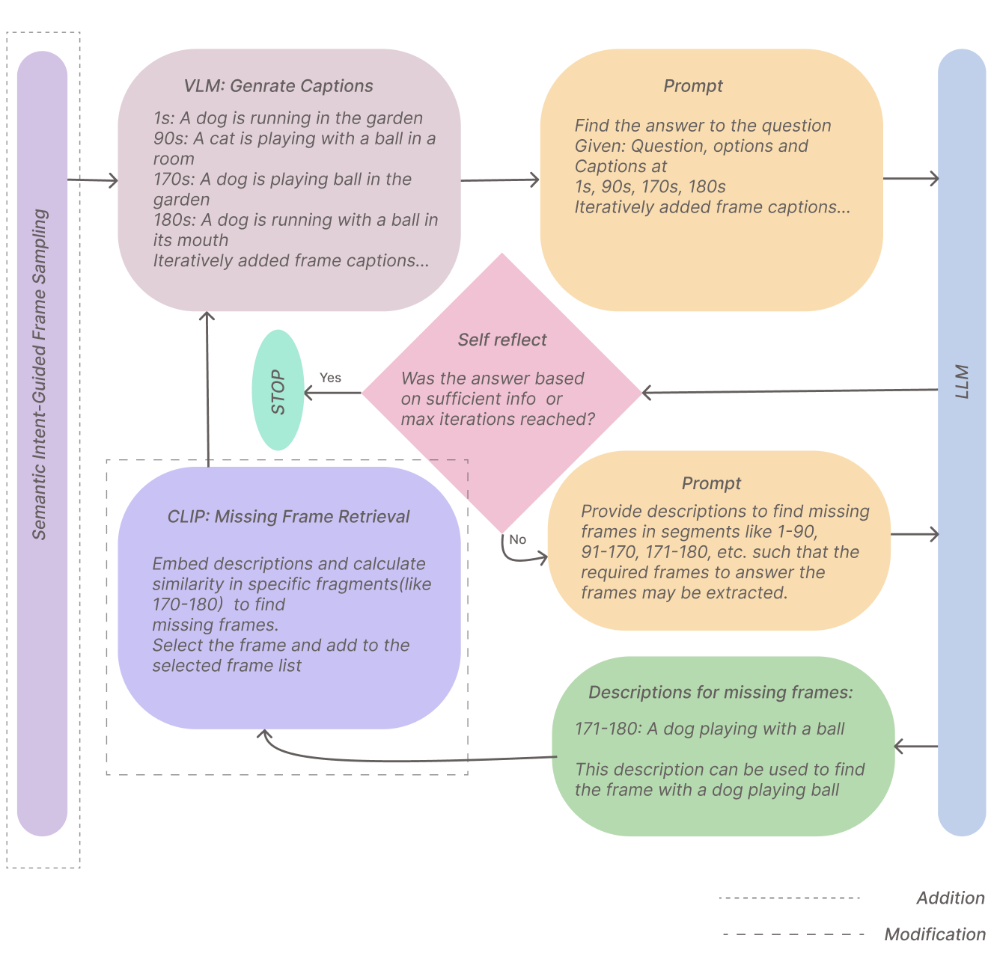

# Semantic Intent-Guided Frame Sampling for Long-Form Video Question Answering

## 🔮 Abstract

Long-form video question answering requires se-
lecting informative frames without processing the entire video.
VideoAgent addresses this through an iterative reasoning–
retrieval loop in which a large language model (LLM) observes
a few frames, identifies missing information, and retrieves addi-
tional frames until it can answer. We introduce a semantic intent-
guided frame sampling strategy that uses CLIP embeddings of
candidate answer options to initialize VideoAgent with frames
most relevant to the question. This targeted initialization provides
the LLM with stronger contextual grounding from the outset,
reducing the chance of overlooking critical events. On a subset
of the EgoSchema benchmark, our approach improves mean
accuracy from 23% to 32.63% (a 9.63 point absolute / 42%
relative gain) with a modest increase in frames per video from
6.3 to 10.42. While tested under limited-resource conditions with
smaller LLMs, the method is model-agnostic and expected to
yield even greater gains with stronger LLMs.

</img>

## 🚀 Getting Started

```bash
download files from https://drive.google.com/drive/folders/1ZNty_n_8Jp8lObudbckkObHnYCvakgvY?usp=sharing
python main.py
python parse_results.py

```
